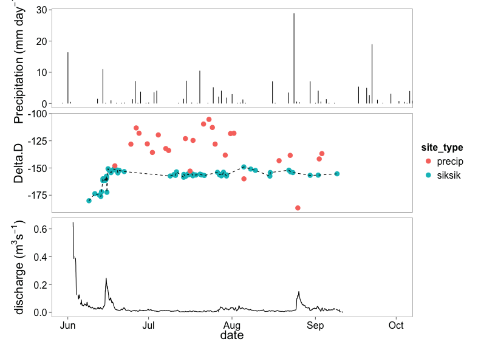
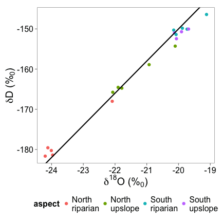
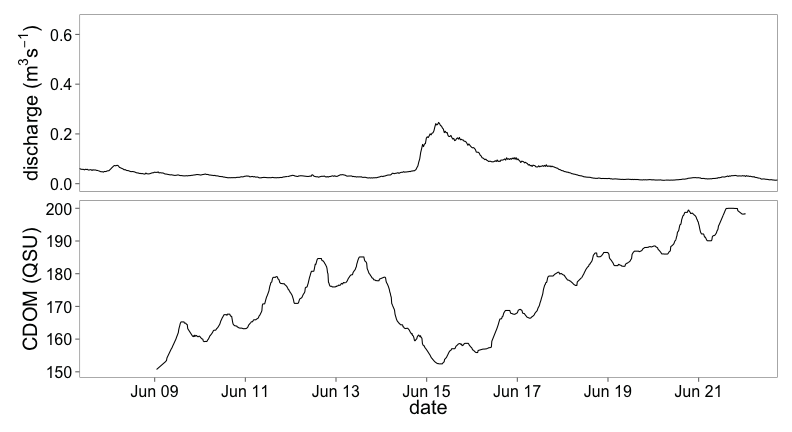
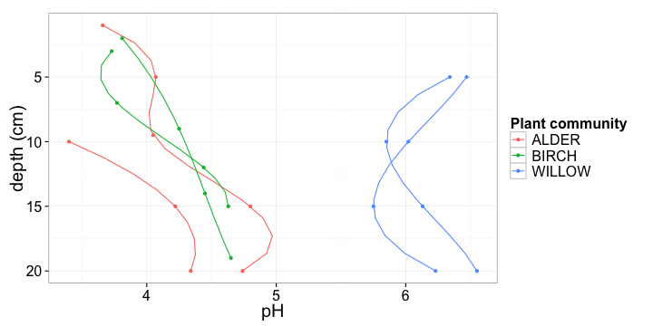

## How to use isotopes to trace water ##
<b> plot of GMWL explanation</b>

---
## Data summary ##

Data           | Frequency | Objective
---------------|-----------|----------
Synoptic sampling | multiple times throughout 13 and 14 | Examine small scales controls
Extra synoptic sites | 2 visits (2014) |  Incorporated into a network geospatial model
Stream discharge  | (15 min - 2014) | Estimating loads and hydrological modelling
Soil water | multiple times at 2 depths (4 locations) during 2014 | Used in estimating transit times and identifying production and sources of DOC
Rainfall collection | throughout 2013 and 2014 | Used as input to transit time modelling
CDOM | (2 weeks during 2014) | Continuous estimates of DOC 


---
## Time series plot##

```
## [1] "encoding"  "inputFile"
```

<b> Time series plot of all the data</b>

---
## Isotope overview ##
<b> plot of isotopes with colours and split into years</b>

---
## Spatial isotopes (lakes etc) ##
<b> plot of isotopes across the lakes</b>

---
## Soil water Isotopes##
<b> Soil water isotope plots with aspect diffs</b>

---
## CDOM data ##
<b> plot of CDOM data</b>

---
## Where to from here ##
Outline what wil be done from this point.
EGU etc.

---
## Work Package 4 ##
Something about intergrating everything

--- 
## Aims and objectives ##

---


## ECOSSE model Outline ##

---

## Wolf Creek overview ##

---
##  Model outline ##

---
## Observed data from Wolf Creek ##

 

---

##  Stream discharge simulations ##

 

---

##  DOC simulations ##

 

---

##  An example ##

 

---

##  An example ##

 

---

##  An example ##

 

---


